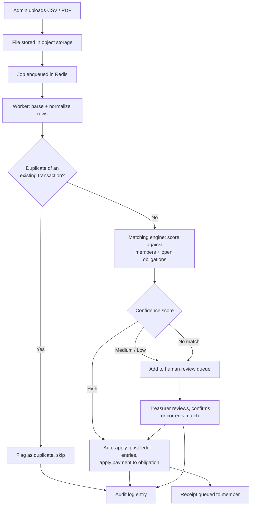
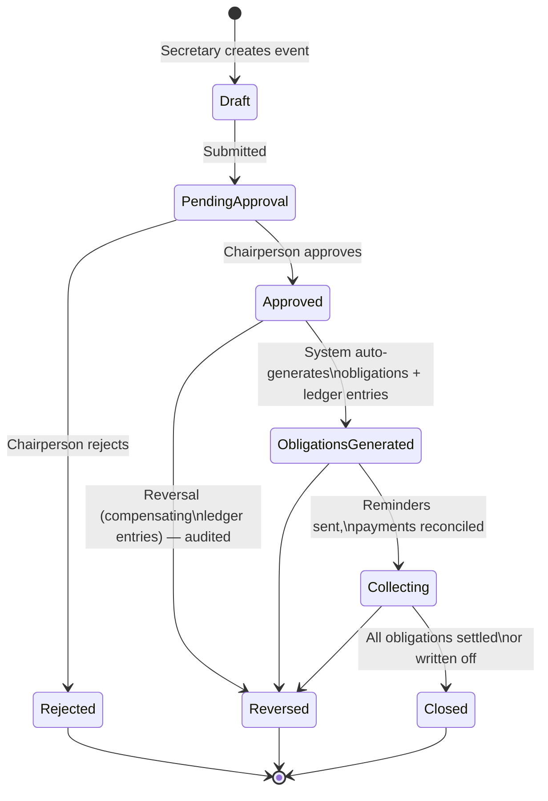

# Addis Kidan Mutual Support Association — Platform Plan
### Smart Association & Mutual-Aid Financial Management Platform
**Document type:** Pre-implementation architecture & product planning blueprint
**Prepared as:** Principal architect / systems-engineering review
**Status:** Planning only — no code. To be approved before any build begins.

---

## 0. How to read this document — and the three things to fix first

Before the 25 formal sections, here is the blunt version, because a planning document that only flatters the original brief is useless.

The brief you supplied is ambitious, well-organized, and shows real thought. But it also contains three assumptions that, if carried into the build unchallenged, will cost you months and possibly the trust of your members. A principal architect's job is to catch these now, while they are free to fix.

**Fix #1 — Stop treating PDF bank-statement ingestion as a core feature. It is a fallback, not a foundation.** OCR of PDF bank statements is brittle, bank-specific, and silently wrong in ways that are catastrophic for a system whose entire purpose is financial trust. You should design the reconciliation engine around *structured* inputs (CSV exports, and where legally possible, a bank-aggregation API) and treat PDF parsing as a last resort with mandatory human review. More on this in Sections 9 and 17.

**Fix #2 — Tithely does not have a general-purpose API you can pull transactions from.** This is a hard external constraint, verified against current Tithely documentation. Tithely supports **CSV export** (date-range filtered) and a fixed set of *pre-built* one-way integrations (QuickBooks Online, Salesforce, Breeze, Elvanto, Planning Center). There is no public REST endpoint where your platform says "give me all gifts since yesterday." So your Tithely integration is, realistically, a **CSV import pipeline** — possibly a scheduled, semi-manual one — not a live API sync. Designing as if a live API exists will break Section 9 and your roadmap. Plan for the world as it is.

**Fix #3 — Do not build microservices, and do not build full multi-tenant SaaS in v1.** This platform, at launch, serves *one* association of likely a few hundred members. Microservices and premature multi-tenancy are the two most common ways small, valuable projects die before reaching users. The correct architecture is a **modular monolith** with a **tenant-ready data model** (an `organization_id` on core tables) but a **single-tenant deployment**. You get 90% of the future-proofing for 10% of the cost. Section 15 explains exactly where the seams go.

A fourth point, less an error than a reframing: **the hard part of this system is not features — it is correctness and auditability of money.** Members are contributing money in a context of grief. If a balance is wrong, or a contribution appears lost, you do not have a bug — you have a trust crisis in a community organization. Everything below is organized around that reality. The single most important technical recommendation in this entire document is in Section 7: **model money as an immutable, append-only double-entry ledger, never as mutable balance columns.**

With that said, here is the full plan.

---

## 1. Executive Summary

The Addis Kidan Mutual Support Association operates a **mutual-aid model**: members contribute regularly, and when a member's household suffers a bereavement or family emergency, the association distributes a predefined sum to that household. The cost of that payout is then shared back across the membership as obligations. The current process is partly manual, which creates four chronic problems: slow reconciliation of incoming money, opaque member balances, heavy administrative burden on a small set of volunteers, and weak auditability.

This document specifies a **web-based platform** that digitizes the full lifecycle: member and household management, bereavement/emergency event handling, automatic obligation calculation, ingestion and reconciliation of payments from bank statements and Tithely, automated billing and reminders, receipts and notifications, an administrator dashboard, and a member self-service portal.

**Recommended technical core:** a **modular-monolith Django application** (Python) with **PostgreSQL**, **Redis** for queues and caching, **Celery** workers for background jobs, a **React/Next.js** frontend for the member portal, **Django's built-in admin as the v1 administrator console**, deployed on **Render.com**. Money is modeled as an **append-only double-entry ledger**. Reconciliation is a **deterministic fuzzy-matching engine with confidence scoring and a human-review queue** — not an "AI" feature. AI is used narrowly and later: PDF text extraction assistance, natural-language financial summaries, and anomaly flagging.

**Recommended delivery:** three phases over roughly 6–10 months of part-time-to-full-time effort. **MVP (Phase 1)** delivers members, events, the ledger, CSV-based reconciliation, manual billing, and email notifications — enough to retire the spreadsheets. **Phase 2** adds the polished member portal, SMS, automated billing, and reconciliation assistance. **Phase 3** addresses multi-organization SaaS, advanced AI, and white-labeling — and should only be funded if a second organization actually wants the product.

**Estimated infrastructure cost:** roughly **$25–70/month** for the MVP on Render, rising to **$150–300/month** at Phase 2 scale with SMS and email volume. This is a small-budget, high-trust system. Spend the budget on correctness, backups, and auditability — not on infrastructure sophistication.

---

## 2. Product Vision

**Vision statement:** *A transparent, low-friction financial backbone for a community that supports its own — so that when a family is grieving, the association's response is immediate, fair, and beyond question.*

The product is not "accounting software." It is a **trust instrument**. Its success is measured less by feature count than by three things:

1. **Every member can see, at any time, exactly what they owe and why** — with a traceable link from each obligation back to the event that created it.
2. **Every dollar that enters the association is accounted for** — matched to a member, or explicitly sitting in a "needs review" queue, never silently lost.
3. **The administrators — who are volunteers — spend dramatically less time on bookkeeping** and more on the association's actual mission.

**What the product deliberately is not, at least initially:** a general-purpose church management system, a payroll system, a tax-filing tool, or a payment processor. It *integrates* with payment tools (Tithely, and optionally Stripe), it does not *become* one. This boundary is what keeps the project finishable.

**Design philosophy.** Three principles override feature requests when they conflict:

- **Correctness over convenience.** A slower workflow that produces a correct, auditable ledger beats a fast one that can drift.
- **Boring over clever.** A volunteer-run organization may one day need to hand this system to a new, less technical administrator, or to a contractor. Conventional, well-documented technology choices are a feature.
- **Visible over hidden.** When the system is unsure (an unmatched payment, an ambiguous name), it surfaces that uncertainty to a human rather than guessing. Silent automation is the enemy of trust.

---

## 3. User Personas

Designing for "the admin" and "the member" as monoliths will produce a mediocre UI. There are at least six distinct people.

**Persona A — The Treasurer / Finance Administrator ("Selam").** The primary power user. Volunteers 5–15 hours/week. Comfortable with spreadsheets, not a developer. Owns reconciliation, billing, and accounting reports. Her pain today: hours spent matching bank lines to members by hand, and being unable to quickly answer "how much is outstanding for the Bekele family event?" She needs speed, bulk actions, keyboard-friendly tables, and trustworthy totals. **She is the persona the MVP must delight.**

**Persona B — The Secretary / General Administrator ("Daniel").** Manages member records, contact info, household changes, and announcements. Less focused on money, more on people and communication. Needs easy member editing, a clean member directory, and bulk messaging.

**Persona C — The Chairperson / Approver ("T(W/ro) Hana").** Does not do data entry. Logs in occasionally to **approve bereavement events and payouts**, and to view high-level financial health. Needs a dead-simple approvals inbox and a one-screen dashboard. Mobile-first — she will often approve from a phone.

**Persona D — The Active Member ("Yonas").** Wants to check his balance, see his contribution history, download receipts, and pay. Tech-comfortable, mostly on a phone. Low tolerance for friction. If paying online is hard, he will keep paying by check and create reconciliation work for Selam.

**Persona E — The Elderly / Low-Tech Member ("Ato Girma").** May not use the portal at all. Receives a paper or emailed statement, pays by check or cash, and occasionally calls Daniel. The system must serve him *indirectly*: clear printed statements, the ability for an admin to record an offline payment on his behalf, and large-text, simple screens if he does log in. **Designing only for Yonas and ignoring Girma will exclude a real and important part of this community.**

**Persona F — The Bereaved Family Member.** Interacts with the system at the worst moment of their year. They should encounter *zero friction and zero financial demands* during the event — the system's job here is to be invisible and gentle. Any obligation owed *by* a grieving household should be automatically waived or deferred (see Section 8).

**Future Persona G — The Platform Owner (Phase 3).** If this becomes multi-org SaaS, a super-admin who onboards organizations and manages billing. Explicitly out of scope for v1; named here only so the data model leaves room for it.

---

## 4. Functional Requirements

Organized by module. "MVP" = Phase 1; "P2"/"P3" = later phases.

**4.1 Member & Household Management**
- Create/edit individuals with contact info, status (active, suspended, inactive, deceased, left), join date, and optional leave date. *(MVP)*
- Group individuals into **households**, with one designated **primary contact** per household. Support a member belonging to exactly one household at a time, with a history of past household membership. *(MVP)*
- Membership tiers (e.g., standard, senior, family) that drive contribution rules. *(MVP — even if only one tier exists at launch, the field must exist.)*
- Roles & permissions: at minimum Member, Secretary, Treasurer, Chairperson, Super-Admin. *(MVP)*
- Emergency contacts and dependents per household. *(MVP for storage; UI can be simple.)*
- Per-member **contribution responsibility rules**: full, partial (with a defined fraction or fixed cap), or exempt. Used for elderly members, hardship cases, and new members. *(MVP)*
- A per-member **history timeline** showing joins, status changes, events, obligations, and payments. *(P2 as a polished view; MVP can rely on the ledger + audit log.)*

**4.2 Bereavement / Emergency Event Management**
- Create an event: type (bereavement, medical emergency, other), affected household, date, description, and the **payout amount** (defaulting from a configurable policy). *(MVP)*
- **Approval workflow:** an event in `draft` → `pending_approval` → `approved` (or `rejected`) before any obligations or payouts are generated. *(MVP)*
- On approval: automatically **calculate each member's obligation** per the contribution-sharing rule, generate obligation records, set a contribution deadline, and create the corresponding ledger entries. *(MVP)*
- Automatic **waiver** of obligations for the affected household itself. *(MVP)*
- Exception handling: manual waivers, partial obligations, deadline extensions, sponsor contributions (one member covering another), and an explicit **emergency override** (chairperson-only, fully audit-logged). *(MVP for waiver + override; sponsor support can be P2.)*
- **Reversal logic:** an approved event can be reversed only by posting compensating ledger entries, never by deleting records. A reversal is itself an audited event. *(MVP — this is not optional for a financial system.)*

**4.3 Financial Reconciliation**
- Import transactions via **CSV** (bank exports and Tithely exports), with a mapping UI for column layouts. *(MVP)*
- Normalize imported rows into a common internal transaction format. *(MVP)*
- **Match** incoming payments to members/obligations using deterministic rules + fuzzy matching, producing a **confidence score**. *(MVP)*
- Auto-apply high-confidence matches; route medium/low-confidence and unmatched rows to a **human review queue**. *(MVP)*
- Detect and flag **duplicate** imports (same amount/date/reference). *(MVP)*
- Flag **suspicious** rows (unexpected amounts, unknown payers, out-of-pattern activity). *(P2)*
- PDF bank statement ingestion. *(P2 — explicitly deprioritized; see Sections 9 and 17.)*
- Optional bank-aggregation API integration (e.g., Plaid) for members who bank with supported institutions. *(P2/P3, jurisdiction-dependent.)*

**4.4 Billing & Collections**
- Generate **invoices/statements** for recurring dues and event-based obligations. *(MVP — generation; automation in P2.)*
- Apply payments to obligations using a defined ordering rule (e.g., oldest-first, or event-priority). *(MVP)*
- Partial payments, payment plans, grace periods, and late fees. *(MVP for partials + grace; payment plans + late fees P2.)*
- Household-level billing (a single statement per household). *(MVP)*
- Delinquency workflow: configurable reminder cadence, escalation, and a delinquency report. *(P2)*
- Auto-generated periodic statements. *(P2)*

**4.5 Communication**
- Transactional email: receipts, statements, reminders, event announcements. *(MVP)*
- SMS notifications. *(P2)*
- Bulk messaging to filtered member segments. *(P2)*
- Template engine with variable substitution, and multi-language templates (English + Amharic at minimum). *(MVP for templates; Amharic content P2.)*
- Scheduled/queued sending with delivery status tracking. *(MVP for queue; status tracking P2.)*
- Push notifications. *(P3.)*

**4.6 Admin Dashboard**
- Financial overview (cash position, total outstanding, recent activity). *(MVP)*
- Reconciliation review queue. *(MVP)*
- Outstanding-balances view, filterable by member/household/event. *(MVP)*
- Event tracker. *(MVP)*
- Export center (CSV/PDF of statements, ledger, member lists). *(MVP)*
- Audit log viewer. *(MVP)*
- Role/permission management. *(MVP)*
- Member insights, KPI widgets, advanced search. *(P2)*

**4.7 Member Portal**
- Login, view balance and obligations, view contribution history, download receipts. *(MVP — can be minimal.)*
- Update own contact information. *(MVP)*
- View event support activity (which events they contributed to). *(P2)*
- Make a payment online — implemented as a **redirect to a hosted payment page** (Tithely or Stripe Checkout), never an in-app card form. *(P2)*
- Receive and view announcements. *(P2)*

---

## 5. Non-Functional Requirements

- **Correctness & integrity.** The financial ledger must be append-only and internally consistent at all times (debits = credits). No code path may delete or mutate a posted ledger entry. This is the highest-priority NFR.
- **Auditability.** Every state change to a member, event, obligation, payment, or ledger entry records *who*, *when*, *what changed*, and *previous value*. The audit log is itself append-only.
- **Availability.** Target 99.5% — appropriate for a volunteer-run association. Do not over-engineer for "five nines"; that budget is better spent on backups.
- **Recoverability.** Recovery Point Objective (RPO) ≤ 24 hours; Recovery Time Objective (RTO) ≤ 8 hours. Daily automated database backups plus a tested restore procedure. **An untested backup is not a backup.**
- **Security.** Encryption in transit (TLS everywhere) and at rest (managed DB encryption). MFA available for all admin roles and required for Treasurer/Super-Admin. See Section 11.
- **Performance.** Page loads < 1.5s for typical views at the expected scale (hundreds to low thousands of members). This is a small-data system; performance is a non-issue if the data model and indexes are sane. Do not prematurely optimize.
- **Scalability.** Must handle the realistic ceiling — say, 5,000 members and 10 years of history — on a single modest database without architectural change. (That is trivially small for PostgreSQL.)
- **Usability & accessibility.** WCAG 2.1 AA as a target. Mobile-first portal. Large-text, high-contrast mode for elderly users. Amharic language support in the member-facing UI.
- **Maintainability.** A competent Django developer unfamiliar with the project should be productive within a day or two. Conventional structure, real documentation, meaningful tests.
- **Data retention.** Financial records retained for a minimum of 7 years (align with nonprofit/charity record-keeping norms in the operating jurisdiction — confirm with an accountant). Personal data of departed members handled per applicable privacy law.
- **Observability.** Centralized logs, error tracking, and basic uptime monitoring from day one.

---

## 6. System Architecture

**6.1 Architectural style: modular monolith.** A single deployable application, internally divided into clear modules with explicit boundaries. This is the correct choice and the brief's "microservices vs modular monolith" question has a decisive answer: **monolith.** Microservices solve organizational scaling problems (many teams shipping independently) and extreme load isolation — you have neither. They would multiply your deployment count, your failure modes, and your Render bill, in exchange for nothing.

**Modules (logical, not separate services):**

- **Identity & Access** — users, roles, permissions, authentication, sessions, MFA.
- **Membership** — members, households, tiers, contribution rules, lifecycle states.
- **Events** — bereavement/emergency events, approval workflow, payout policy.
- **Ledger** — the append-only double-entry accounting core. *No other module writes financial state except through this module's API.*
- **Obligations & Billing** — obligations, invoices/statements, payment application, delinquency.
- **Reconciliation** — import pipelines, normalization, matching engine, review queue.
- **Communications** — templates, email/SMS dispatch, scheduling, delivery tracking.
- **Reporting & Audit** — dashboards, exports, audit log, KPIs.

The discipline that makes this work: modules talk through **defined service interfaces**, not by reaching into each other's database tables. If Phase 3 ever genuinely needs to extract a module into its own service, clean module boundaries make that a refactor, not a rewrite.

**6.2 Runtime components on Render:**

- **Web service** — the Django application serving the API and admin console.
- **Worker service** — a Celery worker consuming the Redis queue (reconciliation jobs, email/SMS sending, statement generation, PDF parsing).
- **Cron jobs** — scheduled tasks: nightly backups verification, reminder dispatch, recurring-dues generation, delinquency sweeps.
- **PostgreSQL** — managed, single primary.
- **Redis (Render Key Value)** — broker for Celery and application cache.
- **Object storage** — for uploaded statements, generated PDFs, receipts. Render disks are an option, but an external S3-compatible bucket is strongly preferred for durability and because it survives service rebuilds (see Section 13).
- **Frontend** — the Next.js member portal, served as its own service (or static deployment).

**6.3 High-level request/data flow (described):**

A member opens the portal → Next.js frontend → authenticated API call to the Django web service → Django reads from PostgreSQL → response rendered. Money never moves on a web request: when an admin uploads a CSV, the web service stores the file and enqueues a job in Redis; a Celery worker picks it up, parses and normalizes rows, runs the matching engine, writes proposed matches and a review queue, and posts ledger entries only for auto-applied high-confidence matches. The admin later reviews the queue and confirms the rest. A nightly cron job generates statements and enqueues reminder emails, which workers dispatch via the email provider. Every one of these steps writes to the audit log.

**6.4 Workflow diagram — reconciliation pipeline (Mermaid):**

---

## 7. Database Design

**7.1 The single most important decision: an append-only double-entry ledger.**

Do **not** store `member.balance` as a column you increment and decrement. Mutable balance fields are how financial systems silently go wrong: a race condition, a half-completed job, or a buggy edit, and the number is now subtly false with no way to know. Instead:

- Every financial fact is one or more **immutable ledger entries**. An entry is never updated or deleted.
- Entries are grouped into **transactions** (a transaction is a set of entries that must net to zero — total debits equal total credits).
- A balance is **always derived** by summing entries, never stored as truth. (You may *cache* a derived balance for performance, clearly labeled as a cache.)
- Corrections happen by posting a **reversing transaction**, leaving the original visible. The ledger tells the whole story, including its own mistakes.

This gives you, for free: a complete audit trail, the ability to reconstruct any balance at any past date, and a structure an accountant immediately understands.

**7.2 Core entities (conceptual — relational, PostgreSQL):**

- **organization** — even in single-tenant v1, every core table carries an `organization_id`. One row exists today. This is the cheap insurance that keeps Phase 3 multi-tenancy possible.
- **user** — login identity. Linked optionally to a `member`.
- **role** / **permission** — role-based access; users have roles scoped to an organization.
- **member** — a person. Status, tier, join/leave dates, contribution-rule reference. Links to a `household`.
- **household** — a group of members; has a primary-contact member.
- **household_membership_history** — append-only record of who belonged to which household and when (handles members moving households).
- **contribution_rule** — defines full/partial/exempt logic, fractions, caps; referenced by members and tiers.
- **event** — a bereavement/emergency event. Type, affected household, payout amount, status, approver, timestamps.
- **obligation** — what a specific member owes for a specific event (or for recurring dues). Amount, due date, status (open, partially paid, paid, waived, written off). Links to the event and member.
- **ledger_account** — the chart of accounts (e.g., Cash, Member Receivables, Event Payout Expense, Member Contributions). Small and fixed.
- **ledger_transaction** — a group of entries; carries a description, date, source reference, and the user who posted it.
- **ledger_entry** — immutable; `transaction_id`, `account_id`, debit or credit amount, and an optional link to the `member`/`obligation`/`event` it concerns.
- **payment** — a recorded inbound payment (from import or manual entry), with method, amount, date, raw source reference, and match status.
- **imported_transaction** — a raw, normalized row from a CSV/PDF import, before matching. Carries the import batch, confidence score, match candidate(s), and review status.
- **import_batch** — one upload; tracks source (bank/Tithely), file reference, row counts, status.
- **invoice / statement** — a generated billing document; lines reference obligations.
- **communication** — a queued/sent message: recipient, channel, template, status, timestamps.
- **audit_log** — append-only; actor, action, entity type/id, before/after snapshot, timestamp.

**7.3 Key relationships & rules:**

- A `household` has many `member`s; a `member` belongs to one current `household` (history preserved separately).
- An `event` generates many `obligation`s (one per liable member) on approval.
- A `payment` applies to one or more `obligation`s; the application creates `ledger_entry` rows.
- `imported_transaction` rows are matched to produce `payment` rows; the raw import is retained for audit even after matching.
- `ledger_entry` rows are **insert-only** — enforced at the database level (revoke UPDATE/DELETE; or a trigger). Application code must not have a path to mutate them.

**7.4 Audit tracking.** Use a consistent mechanism (Django signals or a library such as django-simple-history / django-auditlog) so that every create/update on member, event, obligation, payment, and user records a snapshot. The ledger and audit_log tables are append-only by policy *and* by database permission.

**7.5 Edge cases the schema must accommodate from day one:** a member belonging to multiple households over time; dependents who are not contributing members; a household that is itself the bereaved party (its members' obligations auto-waived); members joining mid-event-cycle (do they owe for events before they joined? — a policy field on the event/contribution rule, not a hardcode); partial-contribution and exempt members; and a deceased *contributing* member whose own passing is itself an event.

---

## 8. API Design Strategy

**8.1 Style.** A **versioned REST API** (`/api/v1/...`), JSON, served by Django REST Framework. REST — not GraphQL — because the data model is well-bounded, the team is small, and REST tooling/caching/debugging is simpler. GraphQL's flexibility is not worth its operational overhead here.

**8.2 Surfaces.**
- **Internal API** — consumed by the Next.js member portal and any future admin SPA. Session- or token-authenticated.
- **Admin console** — for v1, Django's built-in admin *is* the administrator interface (see Section 22). It is not part of the public API; it talks to the ORM directly. This is a deliberate, large time-saving.
- **Webhooks/integration endpoints** — for receiving Tithely/Stripe webhooks if and when used. These must be signature-verified and treated as untrusted input.
- **Future public API** — Phase 3, if the SaaS path is taken. Design v1's internal API cleanly enough that exposing a subset later is feasible.

**8.3 Conventions.** Resource-oriented URLs; standard verbs; consistent pagination, filtering, and sorting; a single consistent error envelope; idempotency keys on any endpoint that creates financial records (so a retried request never double-posts). All money fields are integers in the smallest currency unit (cents) — **never floats.** Every timestamp is UTC with timezone awareness.

**8.4 Auth.** Authenticated requests carry a session cookie (portal) or a token. Authorization is enforced server-side per endpoint by role; never trust the client. Sensitive actions (event approval, ledger reversal, override) require an elevated check and are audit-logged.

**8.5 Documentation.** Auto-generated OpenAPI/Swagger schema, kept current. For a volunteer-handoff project, living API docs are not a luxury.

---

## 9. Reconciliation Engine Design

This is the operational heart of the system, and the brief's framing needs correcting: **most of reconciliation is a deterministic data-matching problem, not an AI problem.** Treating it as "AI reconciliation" invites a fragile, opaque system. Build a transparent rule-based engine first; add ML/LLM assistance only at the edges.

**9.1 Inputs and their reality:**

- **CSV bank exports** — the reliable primary input. Structured, repeatable.
- **Tithely CSV exports** — per current Tithely documentation, Tithely provides **date-range-filtered CSV export** and a set of pre-built integrations, but **no general public API** to pull transactions programmatically. Therefore the Tithely pipeline is: an admin exports a CSV from Tithely on a schedule (e.g., weekly) and uploads it; the system ingests it like any other CSV. Plan the workflow and UI around this. Do not design a "live Tithely sync."
- **PDF bank statements** — supported as a **fallback only.** PDF layouts vary by bank and change without notice; extraction errors in a financial system are unacceptable when unreviewed. Every PDF-derived transaction must pass through human review before it can post to the ledger. If a member's bank only offers PDF, that is a known higher-friction path — and a reason to prefer CSV or, where available, a bank-aggregation API.
- **Stripe/Square/PayPal** — these *do* have proper APIs and webhooks; if the association adopts one, integrate it API-first. This is the model to prefer over PDF for any new payment source.

**9.2 Pipeline stages:**

1. **Ingest** — accept the file, record an `import_batch`, store the original file immutably.
2. **Parse** — CSV: a column-mapping step (saved per source so it is one-time setup). PDF: text extraction via a PDF text layer where present; OCR only for scanned/image PDFs.
3. **Normalize** — convert every row to the internal transaction shape: date, amount (cents), payer name/reference, raw description, source.
4. **De-duplicate** — detect rows already imported (same source + amount + date + reference, or a fingerprint hash). Flag, do not silently drop.
5. **Match** — score each transaction against members and open obligations.
6. **Decide** — apply confidence thresholds.
7. **Post or queue** — auto-post high-confidence; queue the rest for human review.
8. **Review** — Treasurer confirms/corrects; confirmation posts the ledger entries.

**9.3 The matching algorithm (deterministic, explainable):**

For each incoming transaction, compute a confidence score from weighted signals:
- **Exact name match** to a member or household primary contact — strong positive.
- **Fuzzy name match** (normalized, accent-insensitive, handles Amharic/English transliteration variance and name-order differences common in Ethiopian names) — moderate positive, scaled by similarity.
- **Amount match** to an expected obligation or recurring-dues amount — strong positive.
- **A stored payment reference / memo** that members are asked to include — very strong positive (encourage this operationally; it is the cheapest accuracy win available).
- **Timing plausibility** — payment shortly after an obligation was created — mild positive.
- **History** — this payer's prior payments mapped to this member — strong positive once a member has a payment history.

The output is a score plus a **human-readable explanation** ("Matched on exact name + expected amount for Bekele event obligation"). Explainability is mandatory: the Treasurer must understand *why* the system proposed a match.

**9.4 Confidence thresholds:** high → auto-apply; medium → queue with a pre-filled suggested match the reviewer can accept in one click; low/none → queue as unmatched. Thresholds are configurable, and the system should start **conservative** (auto-apply only very-high-confidence) and loosen as the Treasurer gains trust in it. A wrong auto-match erodes trust faster than a slow review queue.

**9.5 Where AI genuinely helps (and only here):**
- **PDF/OCR extraction quality** — an LLM or document-AI service can improve structured extraction from messy PDFs. Output still goes to human review.
- **Suggested matches for hard cases** — an LLM can propose a likely member for an ambiguous payer string, presented as a *suggestion with reasoning*, never auto-applied.
- **Anomaly flagging** — statistical/ML detection of out-of-pattern transactions for the suspicious-entry queue.

These are Phase 2+. The Phase 1 engine is pure deterministic scoring — and that alone will handle the large majority of real transactions.

**9.6 Error handling.** A failed import never partially commits: parse the whole file, validate, then post atomically or not at all. Failed rows are reported back to the admin with row numbers and reasons. The original file is always retained so an import can be re-run after a mapping fix.

---

## 10. Workflow Diagrams (described)

**10.1 Bereavement event lifecycle (Mermaid):**

**10.2 Payment-to-obligation application (described).** An incoming, confirmed payment is applied to that member's open obligations in a configured order (default: oldest obligation first; an event-priority override is possible). Each application posts a balanced ledger transaction: debit Cash, credit Member Receivables, tagged to the obligation. If the payment exceeds outstanding obligations, the remainder is recorded as a credit balance on the member's account (a real ledger position, not a floating note), to be applied to future obligations. A receipt is then queued.

**10.3 Billing cycle (described).** A cron job runs the recurring-dues generator on the configured schedule, creating dues obligations and ledger entries. A statement generator produces per-household statements. A reminder scheduler enqueues notifications based on obligation due dates and a configurable cadence (e.g., 7 days before, on the due date, 7/14/30 days after). Delinquency rules escalate tone and, after a configured threshold, surface the member on a delinquency report for human follow-up — the system never auto-suspends a member over money.

**10.4 Member onboarding (described).** Secretary creates the member and assigns a household, tier, and contribution rule → system creates the `user` identity and emails an invitation → member sets their own password (the system never sets it for them) → member completes their profile in the portal.

---

## 11. Security Architecture

- **Authentication.** Strong password policy; passwords stored only as salted hashes (Django's default hashers). **MFA** (TOTP authenticator app) available to all users, **required for Treasurer and Super-Admin.** Account lockout / throttling on repeated failures.
- **Authorization.** Role-based access control enforced server-side on every endpoint and every admin action. Principle of least privilege: a Secretary cannot post ledger reversals; only the Chairperson can issue an emergency override; only Super-Admin manages roles.
- **Sensitive actions.** Event approval, ledger reversal, emergency override, and bulk financial operations require an elevated permission check and are always audit-logged with actor and reason.
- **Encryption.** TLS for all traffic (Render provides automatic TLS). Database encryption at rest via the managed provider. Application-stored secrets via environment variables / Render secret management — never in the repository.
- **Audit logging.** Append-only, covering authentication events and all financial and membership state changes. Logs are queryable by admins and retained per the retention policy.
- **Financial data protection.** **The platform never stores card or full bank-account numbers.** Online payments are handled by a PCI-compliant hosted processor (Tithely / Stripe Checkout); the platform stores only references and outcomes. This single decision removes the bulk of PCI scope and is non-negotiable.
- **Fraud prevention.** Reconciliation review queue and anomaly flags are the first line. Dual-control on large payouts (an override or large event requires a second approver). The immutable ledger means fraud cannot be hidden by editing history — only by posting visible, audited entries.
- **Rate limiting.** On authentication endpoints, on import endpoints, and on any public webhook receiver.
- **Session management.** Reasonable session lifetimes, secure/HttpOnly cookies, idle timeout for admin sessions, explicit logout, session invalidation on password change.
- **Input handling.** All imports and webhooks are untrusted input: validate, sanitize, verify signatures (webhooks), and never execute or trust file contents.
- **Legal & privacy.** Confirm with a local accountant/lawyer: (a) nonprofit financial-record retention rules in the operating jurisdiction; (b) whether pooling and redistributing member funds triggers any mutual-benefit-society or money-handling regulation; (c) applicable data-privacy obligations for member personal data. *This document flags these; it is not legal advice.*

---

## 12. Notification Architecture

- **Channels:** Email (MVP), SMS (P2), in-app announcements (P2), push (P3).
- **Email provider:** a transactional email service — **Resend, Postmark, or Amazon SES** are all good fits. Postmark for best deliverability on transactional mail; SES for lowest cost at volume. Avoid sending email directly from the app server.
- **SMS provider:** **Twilio** is the default recommendation for reliability and international reach. **Important diaspora consideration:** if members are spread across countries, SMS cost and deliverability vary widely — evaluate **WhatsApp (via Twilio)** or email-first as the primary channel, with SMS reserved for high-priority reminders.
- **Queueing:** all messages are enqueued in Redis and dispatched by Celery workers — never sent synchronously inside a web request. This isolates provider slowness/outages from the user experience and enables retries.
- **Template engine:** versioned templates with variable substitution, supporting English and Amharic. Templates are data, editable by admins without a deploy (P2).
- **Delivery tracking:** capture provider delivery/bounce/failure status on the `communication` record. Repeated bounces flag a member's contact info as stale for the Secretary to fix.
- **Scheduling:** cron-driven reminder windows tied to obligation due dates; bulk announcements scheduled by admins.
- **Compliance:** honor unsubscribe for non-essential messages; financial statements/receipts are transactional and exempt, but the system should still suppress sending to addresses known bad.

---

## 13. Deployment Architecture (Render.com)

Render is a reasonable choice for this project: simple, Git-driven, predictable, and it natively offers exactly the four primitives needed — web service, background worker, cron jobs, and managed PostgreSQL. The plan should, however, be clear-eyed about its cost shape and one specific trap.

**13.1 Render service layout:**
- **Web service** — Django app (gunicorn/uvicorn). Starter or Standard instance.
- **Background worker** — Celery worker. Separate service.
- **Cron jobs** — one or more scheduled jobs for reminders, recurring dues, backup verification.
- **Managed PostgreSQL** — primary database.
- **Render Key Value (Redis)** — Celery broker + cache.
- **Frontend** — Next.js portal as a separate web service or static site.

**13.2 The trap to avoid.** Render's **free PostgreSQL tier is deleted after 90 days.** A financial system must **never** run on it. Provision a **paid** database from the start, on a tier that includes **point-in-time recovery** — note that PITR is only available on Render's higher database tiers, so budget for it deliberately rather than discovering the gap during an incident.

**13.3 File storage.** Prefer an **external S3-compatible object store** for uploaded statements and generated PDFs over Render disks. Render disks are tied to a service and complicate rebuilds and scaling; object storage is independently durable and the natural home for documents you must retain for years.

**13.4 Environments.** At least two: **production** and **staging**. Staging mirrors production for testing imports and migrations against realistic (anonymized) data before they touch real money. This doubles some service costs — accept it; testing financial code in production is not an option.

**13.5 Configuration & secrets.** All config via environment variables; secrets via Render's secret management. Infrastructure defined in a `render.yaml` blueprint so the environment is reproducible and reviewable.

**13.6 Backups & disaster recovery.** Daily automated database backups (managed by Render) **plus** an independent periodic logical dump (`pg_dump`) copied to the object store in a *different* account/region — do not let your only backups live with your only database provider. **Quarterly, perform an actual restore drill** into staging and verify the data. Document the DR runbook: how to restore, who is authorized, expected RTO. RPO ≤ 24h, RTO ≤ 8h.

**13.7 Region & latency.** Render's regions are US/EU-centric. For an Ethiopian-diaspora membership, choose the region closest to where most members and admins actually are (likely US East or EU). Latency is not critical for this app, but pick deliberately.

---

## 14. DevOps Strategy

- **Source control:** Git, single repository (a monorepo for backend + frontend is fine at this size), protected `main` branch, pull-request review even if the team is one or two people — the PR is a forcing function for a second look at money-touching code.
- **CI pipeline:** on every PR — run linters, type checks, the full automated test suite, and a database-migration check. A PR that breaks tests or migrations cannot merge.
- **CD pipeline:** merge to `main` → auto-deploy to **staging**. Promotion to **production** is a manual, deliberate step. Render's Git-driven deploys make this straightforward.
- **Database migrations:** versioned, reviewed, tested on staging against production-shaped data first. Migrations that touch financial tables get extra scrutiny and a rollback plan.
- **Monitoring & observability:** error tracking (**Sentry**), uptime monitoring (a simple external pinger or Render's own), centralized application logs, and a small set of business-health alerts (e.g., "import job failed", "worker queue backed up", "daily backup did not complete").
- **Runbooks:** written procedures for the recurring scenarios — restoring a backup, re-running a failed import, reversing an event, rotating a leaked secret. Volunteer-run handoffs make runbooks essential, not optional.
- **Dependency hygiene:** pinned dependencies, scheduled security-update review.

---

## 15. Scalability Strategy

**15.1 Be honest about scale.** At launch this is hundreds of members. Even an optimistic ceiling — thousands of members, a decade of events and ledger entries — is *small* for PostgreSQL. The MVP needs **no** sharding, no read replicas, no caching beyond Redis basics, no microservices. Sound schema design and correct indexes are the entire scalability story for v1. Building for imaginary scale is the failure mode to avoid.

**15.2 Vertical first.** When load grows, the first move is a bigger Render instance and database tier. This carries the project very far.

**15.3 Multi-tenancy — the right way, at the right time.** The brief envisions an eventual multi-organization SaaS. The correct preparation:
- **Now (v1):** include `organization_id` on every core table; scope all queries by it; deploy single-tenant with one organization row. This is nearly free and keeps the door open.
- **Phase 3 (only if a real second organization exists):** adopt **shared-database, row-level tenant isolation** — one database, every query filtered by `organization_id`, enforced centrally (e.g., via PostgreSQL row-level security and/or a query-layer guard) so isolation cannot be forgotten in a single endpoint. This is the right model for a modest number of small organizations: simplest to operate, cheapest, easiest to back up.
- **Schema-per-tenant or database-per-tenant** only if a future enterprise client demands hard isolation. Do not start there — it multiplies migration and operational cost.

**15.4 SaaS building blocks for Phase 3:** organization onboarding/self-signup, a subscription-billing layer (Stripe Billing) for charging organizations, per-organization configuration (payout policies, branding for white-label), and a super-admin console. All explicitly deferred — and explicitly *enabled* by the `organization_id` discipline started in v1.

**15.5 Data growth & partitioning.** If the ledger ever becomes large enough to matter (years away, if ever), PostgreSQL **table partitioning by date** on ledger and audit tables is the answer — long before anything more exotic.

---

## 16. AI Integration Opportunities

A deliberately skeptical take: **AI is a Phase 2+ enhancement layer, not part of the MVP foundation.** The MVP must be fully correct and useful with zero AI. Then:

**Practical, Phase 2:**
- **PDF/document extraction assistance** — document-AI to improve structured extraction from messy bank-statement PDFs. Output always goes to human review.
- **Match suggestions for hard cases** — an LLM proposes a likely member for an ambiguous payer string, *with reasoning*, as a suggestion the Treasurer accepts or rejects. Never auto-applied.
- **Natural-language financial summaries** — generate a plain-English (and Amharic) narrative of a statement or a monthly financial overview from the structured ledger data. Genuinely useful for non-accountant admins and members. Low risk because it summarizes data the system already holds.
- **Anomaly detection** — statistical/ML flagging of out-of-pattern transactions for the suspicious-entry queue. This can start as simple rules and graduate to ML.

**Phase 3, or skip:**
- **Predictive delinquency analysis** — predicting which members may fall behind. Useful, but needs years of history to be meaningful and risks feeling intrusive in a community context. Treat carefully.
- **AI admin assistant** — a conversational helper for admins ("show me everyone outstanding on the Bekele event"). A nice convenience, not a priority.

**Cost & deployment stance.** Use **hosted API models** (e.g., a commercial LLM API) for the occasional, low-volume tasks above — volumes here are tiny, so API cost is negligible and self-hosting models is unjustified operational burden. The one exception worth watching is document/OCR processing if PDF volume ever becomes large; even then, a hosted document-AI service is likely cheaper than running infrastructure.

**Hard rule for every AI feature:** AI may *suggest* and *summarize*; it must never *decide* a financial outcome unreviewed. The ledger is governed by deterministic rules and human confirmation. This is what keeps the system trustworthy.

---

## 17. Risk Assessment

| # | Risk | Likelihood | Impact | Mitigation |
|---|------|-----------|--------|------------|
| R1 | **PDF bank-statement parsing is unreliable**, producing wrong financial data | High | Severe | Deprioritize PDF; build on CSV; mandatory human review for all PDF-derived rows; prefer bank-aggregation API where available |
| R2 | **No Tithely API** — the assumed live integration does not exist | Certain | High (if undetected) | Already mitigated in this plan: design Tithely as a scheduled CSV-import workflow |
| R3 | **Scope creep into a full SaaS / church-management system** before the MVP ships | High | Severe | Strict phase gates; Phase 3 funded only on a real second customer |
| R4 | **A wrong balance erodes member trust** in a grief context | Medium | Severe | Immutable double-entry ledger; reversal-not-deletion; audit log; conservative auto-match thresholds |
| R5 | **Data loss** (no/untested backups) | Medium | Severe | Paid DB with PITR; independent off-provider dumps; quarterly restore drills |
| R6 | **Volunteer-team key-person dependency** — the builder leaves | High | High | Conventional stack; thorough docs and runbooks; PR discipline; Django admin reduces custom surface area |
| R7 | **Reconciliation auto-matches incorrectly**, misallocating money | Medium | High | Explainable scoring; start conservative; human review queue; easy correction via reversal |
| R8 | **Online payments create PCI/security exposure** | Medium | Severe | Never handle card data; hosted processor only (Tithely/Stripe Checkout) |
| R9 | **Regulatory exposure** from pooling/redistributing member funds | Unknown | High | Obtain local legal/accounting review before launch |
| R10 | **Render cost creep** as services multiply (web + worker + cron + DB + Redis + staging) | Medium | Medium | Model full cost up front (Section 19); consolidate where sensible; review quarterly |
| R11 | **Low portal adoption** by elderly/low-tech members | High | Medium | Admin-recorded offline payments; clear printed statements; large-text mode; do not make the portal the only path |
| R12 | **Name-matching fails** on Amharic/English transliteration and name-order variance | High | Medium | Transliteration-aware, accent-insensitive fuzzy matching; encourage payment references; member payment history |
| R13 | **SMS cost/deliverability** across many countries | Medium | Medium | Email-first; evaluate WhatsApp; SMS only for high-priority messages |

**Top three to act on immediately:** R3 (scope discipline), R4/R5 (ledger integrity + backups), R2 (Tithely reality). The rest are managed by the design choices above.

---

## 18. Technical Tradeoffs

**18.1 Backend: Django vs Node.js/NestJS — recommend Django.**

| Factor | Django (Python) | NestJS (Node) |
|--------|-----------------|---------------|
| Admin console | **Built-in admin can be the v1 admin UI — huge time saver** | Must be built from scratch |
| ORM & migrations | Mature, batteries-included | Capable (TypeORM/Prisma), more assembly |
| Auth, permissions | Built-in | Assemble from libraries |
| Data/OCR/PDF ecosystem | **Excellent (Python)** | Workable, less rich |
| Type safety | Add-on (type hints) | **Native TypeScript** |
| Team familiarity | Depends on team | Depends on team |

**Verdict: Django.** The decisive factor is the **built-in admin** — for a financial back-office tool, it can serve as the entire administrator interface in v1, eliminating months of CRUD UI work. Combined with Python's strength in data/PDF/OCR work and Django's batteries-included auth and migrations, it is the lower-risk, faster path. Choose NestJS only if the team is strongly TypeScript-native and weak in Python — team skill can legitimately override this.

**18.2 Frontend: React vs Next.js — recommend Next.js** for the member portal: SSR/SEO for any public pages, file-based routing, strong defaults. The admin side uses Django admin in v1, so the frontend build is *just* the member portal — a deliberately small surface.

**18.3 Background processing: Celery vs BullMQ — recommend Celery**, because the backend is Django/Python; Celery is the native, mature choice. BullMQ would be correct *only* if the backend were Node. This tradeoff is decided by the backend choice, not independently.

**18.4 Database: PostgreSQL — no real tradeoff.** It is the right answer: relational integrity for financial data, transactions, mature tooling, row-level security for future multi-tenancy, JSON columns where flexibility is needed. Recommended unambiguously.

**18.5 Cache/broker: Redis — recommended**, serving double duty as Celery broker and application cache. Note Render's Redis pricing is not trivial; one modest instance is enough for v1.

**18.6 Architecture: microservices vs modular monolith — modular monolith, decisively.** Covered in Section 6. Microservices buy nothing here and cost deployment complexity, distributed-system failure modes, and money.

**18.7 API: REST vs GraphQL — REST.** Bounded data model, small team, simpler tooling and caching. GraphQL's flexibility does not pay for its overhead here.

**18.8 OCR/PDF tooling.** For PDFs with a real text layer, a text-extraction library suffices. For scanned/image PDFs, an OCR engine (e.g., Tesseract) or a hosted document-AI service. Given R1, invest minimally here and push users toward CSV.

---

## 19. Cost Estimation

Infrastructure costs are modest; the dominant real cost is **engineering time.** Figures are approximate monthly USD and should be re-checked against current Render pricing at build time.

**MVP / Phase 1 (single tenant, low volume):**

| Item | Approx. monthly |
|------|-----------------|
| Render web service (Starter/Standard) | $7–25 |
| Render background worker | $7–25 |
| Render cron job(s) | ~$1 each |
| Managed PostgreSQL (paid tier — **must not use free tier**) | $7–25 |
| Redis / Key Value | $10+ |
| Object storage (S3-compatible) | $1–5 |
| Email provider (low volume) | $0–15 |
| Error tracking (Sentry, free/low tier) | $0–26 |
| **MVP subtotal** | **~$40–130/month** |

A lean MVP can sit near the low end (~$40–70); add a **staging environment** and several services roughly double. Domain (~$15/year) and TLS (free on Render) are minor.

**Phase 2 (portal, SMS, automation, higher volume):** larger instances, higher email volume, SMS via Twilio (usage-based — depends heavily on member count and message frequency, and on SMS-vs-WhatsApp-vs-email mix), PITR-capable database tier. Realistic range: **~$150–300/month.**

**Phase 3 (multi-tenant SaaS):** scales with the number of organizations; offset by subscription revenue. Add Stripe Billing fees and more support tooling. Not estimated here — model it when a real second customer exists.

**One-time / occasional:** legal & accounting review (strongly recommended, R9), and any paid document-AI usage in Phase 2 (low, given small volumes).

**The honest bottom line:** infrastructure is cheap. The investment is the build effort and the discipline to test financial code properly. Do not cut corners on backups or staging to save $25/month.

---

## 20. MVP vs Phase 2 vs Phase 3 Roadmap

**Phase 1 — MVP ("retire the spreadsheets"). Target ~3–4 months.**
Goal: a correct, auditable system the Treasurer and Secretary use daily instead of spreadsheets.
- Member & household management; tiers; contribution rules; lifecycle states.
- Roles & permissions; authentication; MFA for finance roles.
- Event creation + approval workflow; automatic obligation generation; waivers; reversal logic.
- **The double-entry ledger** — the non-negotiable core.
- CSV import + the deterministic matching engine + human review queue.
- Manual/basic billing and statement generation; payment application.
- Email notifications (receipts, statements, reminders) via queue + workers.
- Admin console = **Django admin**, lightly customized.
- A **minimal** member portal: login, view balance/history, download receipts, update contact info.
- Audit logging; export center; backups + a tested restore.
**Exit criteria:** the association runs a full real bereavement event end-to-end in the system, with reconciliation, and the Treasurer trusts the numbers.

**Phase 2 — "Polish, automate, communicate." Target ~3–4 months after MVP.**
- Polished, mobile-first, Amharic-capable member portal; large-text/accessible mode.
- Online payments via hosted processor (Tithely/Stripe Checkout redirect).
- Automated billing cycles, recurring dues, late fees, payment plans, delinquency workflow.
- SMS / WhatsApp notifications; bulk messaging; admin-editable templates.
- Reconciliation enhancements: PDF ingestion (review-gated), AI-assisted match suggestions, anomaly flagging, suspicious-entry queue.
- Richer admin dashboard: KPIs, insights, advanced search; AI-generated financial summaries.
- Bank-aggregation API integration (e.g., Plaid) where members' banks support it and jurisdiction allows.

**Phase 3 — "SaaS, if the market is real." Only if a second organization commits.**
- Full multi-tenant operation (shared DB, row-level isolation).
- Organization self-onboarding; white-label branding; per-org configuration.
- Subscription billing (Stripe Billing) for organizations.
- Public API; super-admin console.
- Predictive delinquency, AI admin assistant, push notifications.
**Gate:** do not start Phase 3 speculatively. A second paying/committed organization is the entry criterion.

---

## 21. Recommended Tech Stack (summary)

- **Backend:** Django (Python) + Django REST Framework — modular monolith.
- **Admin console (v1):** Django Admin, lightly customized.
- **Frontend (member portal):** Next.js (React).
- **Database:** PostgreSQL (managed, paid tier with PITR).
- **ORM:** Django ORM.
- **Background jobs / queue:** Celery + Redis broker.
- **Cache:** Redis.
- **Auth:** Django auth + TOTP MFA; RBAC.
- **File/object storage:** S3-compatible object store.
- **Email:** Postmark or Amazon SES; **SMS/WhatsApp:** Twilio.
- **Search:** PostgreSQL full-text search (sufficient at this scale — do not add Elasticsearch).
- **Hosting:** Render.com — web service, background worker, cron jobs, managed Postgres, Key Value.
- **CI/CD:** Git-based, automated tests + migration checks, auto-deploy to staging, manual promotion to production; `render.yaml` blueprint.
- **Monitoring:** Sentry (errors), uptime monitoring, centralized logs.
- **AI (Phase 2+):** hosted LLM/document-AI APIs for extraction assistance, summaries, and match suggestions only.

**The rationale in one line:** every choice favors maturity, conventionality, and a small surface area, because the scarce resource is trustworthy engineering time and the binding constraint is a volunteer-run handoff.

---

## 22. UI/UX Recommendations

**22.1 Two interfaces, two design philosophies.**
- **Admin (Treasurer/Secretary):** information-dense, fast, keyboard-friendly. Dense tables with strong filtering and sorting, bulk actions, inline editing. The reconciliation review queue is the centerpiece — it should let the Treasurer accept a suggested match in one click and correct a wrong one in two. Django admin gets you most of this in v1 for free; customize the reconciliation queue and dashboard, leave the rest stock.
- **Member portal:** simple, calm, mobile-first. A member should answer "what do I owe and why?" within five seconds of logging in. Few screens, large touch targets, plain language.

**22.2 Designing for the whole community.**
- **Elderly / low-tech members:** a large-text, high-contrast mode; minimal navigation; plain-language labels (avoid accounting jargon — "what you owe", not "outstanding receivables"). Crucially, the portal is **optional** — the Secretary can do anything on a member's behalf, and printed/emailed statements must stand alone.
- **Language:** English and Amharic throughout the member-facing UI. Get Amharic *content* (templates, statements) reviewed by a native speaker — machine translation of financial notices is not acceptable.
- **Accessibility:** WCAG 2.1 AA target — semantic markup, keyboard navigation, sufficient contrast, screen-reader-friendly tables.

**22.3 Tone in a grief context.** When a household is the subject of a bereavement event, every screen and message touching that household must be gentle and free of payment demands. The bereaved owe nothing and are reminded of nothing. The product's emotional intelligence here matters as much as its correctness.

**22.4 Dashboard.** One screen, the answers a Chairperson or Treasurer needs at a glance: cash position, total outstanding, active events, items awaiting reconciliation review, items awaiting approval. Drill-down from each. Resist the urge to add charts that look impressive but answer no real question.

---

## 23. Testing Strategy

For a financial system, testing is not overhead — it is the cost of being allowed to handle money.

- **Unit tests** — heaviest coverage on the **ledger** and **obligation-calculation** logic. Every contribution-sharing rule, every waiver, every reversal, every edge case from Section 7.5 gets a test. Target near-complete coverage of money-touching code; the ledger should be the most thoroughly tested module in the system.
- **Integration tests** — full flows: create event → approve → obligations generated → ledger entries balanced; import CSV → match → review → post → receipt. Verify that **debits always equal credits** as an invariant after every operation.
- **Reconciliation tests** — a corpus of real-shaped (anonymized) CSV samples covering messy names, transliteration variants, duplicates, partial payments, overpayments, and unmatched rows. Assert correct confidence scoring and routing.
- **Property/invariant tests** — assert system-wide invariants: the ledger always balances; no obligation is over-applied; no ledger entry is ever mutated.
- **API tests** — authorization on every endpoint (a Secretary cannot post a reversal; a Member sees only their own data); idempotency on financial endpoints.
- **End-to-end tests** — a small set covering the critical member and admin journeys in a browser.
- **Migration tests** — every migration runs cleanly forward on production-shaped data in CI.
- **Manual UAT** — before each release, the actual Treasurer runs a real scenario on **staging**. The person who will trust the numbers must verify the numbers.
- **Security testing** — dependency scanning in CI; before launch, a focused review of auth, RBAC, and the import/webhook input paths.

**Rule:** no code that creates or mutates ledger or obligation data merges without tests. No exceptions.

---

## 24. Maintenance Strategy

- **Documentation as a deliverable.** Architecture overview, data-model reference, the chart of accounts and its meaning, runbooks (restore a backup, re-run an import, reverse an event, rotate a secret, onboard a new admin). For a volunteer organization, this is what survives turnover.
- **Dependency upkeep.** Scheduled (e.g., monthly) review of dependency and security updates; pinned versions; test suite as the safety net for upgrades.
- **Backup verification.** Quarterly restore drills into staging — and treat a drill failure as a top-priority incident.
- **Monitoring discipline.** A small, meaningful alert set (failed imports, backed-up worker queue, failed backup, error spikes). Few alerts, all actionable — alert fatigue is a real failure mode.
- **Financial-data corrections.** A documented procedure: corrections are *always* reversing entries, never edits. Anyone maintaining the system must understand this before touching the ledger.
- **Periodic financial review.** Support the Treasurer in a periodic reconciliation of the system's ledger against actual bank balances — the ultimate external check that the system is correct.
- **Knowledge continuity.** Assume the original builder will eventually leave. The combination of a conventional stack, real docs, runbooks, and Django admin (less custom code to understand) is the deliberate mitigation. A planned handoff/onboarding doc for a future maintainer should exist before launch.
- **Change management.** Even post-launch, money-touching changes go through staging and UAT. The discipline does not relax after v1.

---

## 25. Step-by-Step Execution Plan

A sequenced path from this document to a running MVP. Durations assume a small team and are indicative.

**Step 0 — Decisions & approvals (1–2 weeks).** Review and sign off on this document. Confirm the team's language strength (Django vs NestJS — this plan assumes Django). Obtain the legal/accounting review on fund-pooling and record retention (R9). Confirm where members actually bank (decides whether bank-aggregation APIs are even an option). **Do not skip Step 0.**

**Step 1 — Foundations (1–2 weeks).** Repository, project skeleton, `render.yaml` blueprint, CI pipeline, staging + production environments, paid PostgreSQL, Redis, error tracking, object storage. Establish the backup job and perform one restore drill *before any real data exists* — prove the safety net first.

**Step 2 — The ledger (2–3 weeks).** Build the append-only double-entry ledger and chart of accounts *first*, with exhaustive tests. Everything financial depends on it. Treat this as the keystone — get it right before building on it.

**Step 3 — Membership (2 weeks).** Members, households, tiers, contribution rules, lifecycle states, roles/permissions, audit logging. Django admin gives the editing UI.

**Step 4 — Events & obligations (2–3 weeks).** Event model, approval workflow, automatic obligation generation wired to the ledger, waivers, overrides, reversal logic. Heavy testing of the contribution-sharing math.

**Step 5 — Reconciliation MVP (3–4 weeks).** CSV import pipeline, column mapping, normalization, the deterministic matching engine with confidence scoring, the human review queue. Test against an anonymized corpus of real Tithely and bank CSVs. PDF ingestion explicitly deferred.

**Step 6 — Billing & notifications (2–3 weeks).** Statement generation, payment application, basic reminders. Email via queue + workers. Receipts.

**Step 7 — Minimal member portal (2–3 weeks).** Next.js portal: login, balance, history, receipt download, contact-info update. Intentionally small.

**Step 8 — Hardening & UAT (2–3 weeks).** Security review (auth, RBAC, import paths), end-to-end tests, performance sanity check, accessibility pass. The Treasurer runs a full real scenario on staging. Finalize runbooks and the maintainer handoff doc.

**Step 9 — Migrate & launch (1–2 weeks).** Carefully import existing member and historical financial data — the most delicate step; reconcile imported balances against the spreadsheets line by line before go-live. Soft launch with admins only, then open the portal to members.

**Step 10 — Stabilize, then Phase 2.** Run the MVP for a real cycle or two; fix what reality reveals; *then* plan Phase 2 against actual usage data — not against today's guesses.

**Total to MVP launch:** roughly **4–6 months** at a steady pace, depending on team size and availability.

---

## Closing note from the architect's chair

This is a genuinely worthwhile system, and the brief behind it is thoughtful. The way it succeeds is not by being clever — it is by being **correct, auditable, and finishable.** The three reframings at the top (PDF is a fallback, Tithely is CSV-only, no microservices / no premature SaaS) and the one keystone decision (an immutable double-entry ledger) are what separate a platform this community will trust for a decade from a half-built one that quietly drifts and gets abandoned.

Build the ledger first. Test the money code like lives depend on it. Keep the elderly member who never logs in fully served. Resist every feature that does not help the MVP retire the spreadsheets. Ship Phase 1, let real use teach you, and only then expand.

When you are ready to move from planning to building, the natural first artifact is a detailed data-model specification and the chart of accounts — that is where the next document should begin.
